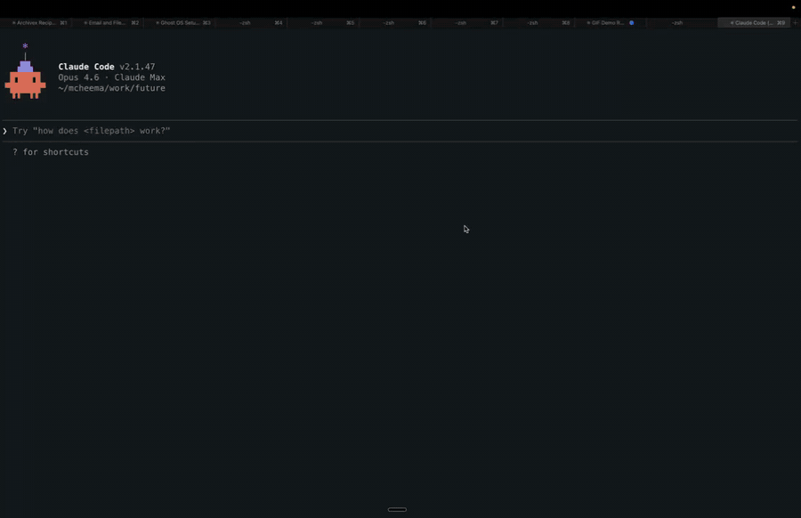

<p align="center">
  
</p>

<h1 align="center">Ghost OS</h1>
<p align="center"><em>Full computer-use for AI agents.</em></p>

<p align="center">
  <a href="LICENSE"></a>
  
  
  
</p>

---

Your AI agent can write code, run tests, search files. But it can't click a button, send an email, or fill out a form. It lives inside a chat box.

Ghost OS changes that. One install, and any AI agent can see and operate every app on your Mac.

```
You:     "Send an email to sarah@company.com about the Q4 report"
Agent:   ghost_run recipe:"gmail-send" params:{recipient, subject, body}
         → Compose opens, fields fill, email sends. Done.
```

### Setup


### Recipes in Action
Send emails and download papers. Any app. Any workflow.


### Beyond the Browser
Slack messages, Finder folders — Ghost OS operates native macOS apps, not just browsers.



## Why Ghost OS?

Other computer-use tools take screenshots and guess what's on screen. Ghost OS reads the macOS accessibility tree — structured, labeled data about every element in every app. When the AX tree isn't enough (web apps, dynamic content), it falls back to a local vision model (ShowUI-2B) for visual grounding.

And when it figures out a workflow, it saves it. Other tools repeat the same expensive reasoning every time.

- **Self-learning** — A frontier model figures out the workflow once. A small model runs it forever.
- **Transparent** — Recipes are JSON. Read every step before running. No black box.
- **Native** — Accessibility tree first. Vision fallback when needed. Structured data over pixel guessing.
- **Any app** — Not just browsers. Slack, Finder, Messages — anything on your Mac.
- **Local** — Your data never leaves your machine.
- **Open** — MCP protocol. Works with Claude Code, Cursor, VS Code, or any MCP client.

| | | Ghost OS | Anthropic Computer Use | OpenAI Operator | OpenClaw |
|:---:|------|:--:|:--:|:--:|:--:|
| 👀 | **How it sees** | Accessibility tree + local VLM | Screenshots only | Screenshots only | Browser DOM |
| 🖥️ | **Native apps** | Any macOS app | Any (via pixels) | Browser only | Browser only |
| 🧠 | **Learns workflows** | JSON recipes | No | No | No |
| 🔒 | **Data stays local** | Yes | Depends on setup | No (cloud) | Yes |
| 📖 | **Open source** | MIT | No | No | MIT |

## Install

```bash
brew install ghostwright/ghost-os/ghost-os
ghost setup
```

That's it. `ghost setup` handles permissions, MCP configuration, recipe installation, and vision model setup.

<details>
<summary>macOS beta? Use the manual install instead.</summary>

Homebrew has a known issue on macOS developer betas where it demands an Xcode version that doesn't exist yet. If `brew install` fails, install directly:

```bash
curl -sL https://github.com/ghostwright/ghost-os/releases/latest/download/ghost-os-2.0.5-macos-arm64.tar.gz | tar xz
sudo cp ghost /opt/homebrew/bin/
sudo cp ghost-vision /opt/homebrew/bin/
sudo mkdir -p /opt/homebrew/share/ghost-os
sudo cp GHOST-MCP.md /opt/homebrew/share/ghost-os/
sudo cp -r recipes /opt/homebrew/share/ghost-os/
sudo cp -r vision-sidecar /opt/homebrew/share/ghost-os/
ghost setup
```

</details>

## How It Works

Ghost OS connects to your AI agent through [MCP](https://modelcontextprotocol.io) and gives it 22 tools to see and operate your Mac. It reads the macOS accessibility tree for structured data about every app. For web apps where the AX tree falls short (Gmail, Slack), a local vision model (ShowUI-2B) finds elements visually. Click, type, scroll, press keys, manage windows. Any app, not just browsers.

```
You:     "Download the latest paper on chain-of-thought prompting from arXiv"
Agent:   ghost_run recipe:"arxiv-download" params:{query:"chain of thought prompting"}
         → Navigates to arXiv, searches, opens PDF, downloads to Desktop. Done.
```

Works with Claude Code, Cursor, VS Code, or anything that speaks MCP.

## Recipes

When your agent figures out a workflow, it saves it as a recipe. A recipe is a JSON file with steps, parameters, and wait conditions. Transparent and auditable.

**A frontier model figures out the workflow once. A small model runs it forever.**

```bash
# One command sends an email
ghost_run recipe:"gmail-send" params:{"recipient":"hello@example.com","subject":"Hello","body":"World"}

# 7 steps, 30 seconds, 100% reliable
```

- Recipes are just JSON. Read every step before running.
- Share with your team. One person learns the workflow, everyone benefits.
- Chain recipes together. The agent knows when to call what.
- Write once with Claude or GPT-4. Run forever with Haiku.

## 22 Tools

| | Tool | What it does |
|:---:|------|-------------|
| 🔍 | `ghost_context` | Get the current app, window title, URL, focused element, and all interactive elements on screen |
| 🔍 | `ghost_state` | List every running app with its windows, positions, and sizes |
| 🔍 | `ghost_find` | Search for elements by name, role, DOM id, or CSS class across the entire UI |
| 🔍 | `ghost_read` | Extract text content from any app, with depth control for nested content |
| 🔍 | `ghost_inspect` | Get complete metadata for one element: role, position, actions, DOM id, editable state |
| 🔍 | `ghost_element_at` | Identify what element is at a specific screen coordinate |
| 📸 | `ghost_screenshot` | Capture a window screenshot for visual debugging |
| 👁️ | `ghost_ground` | Find element coordinates using vision (ShowUI-2B). Works when AX tree can't find web elements |
| 👁️ | `ghost_parse_screen` | Detect all interactive elements via vision |
| 🎯 | `ghost_click` | Click an element by name, DOM id, or screen coordinates |
| ⌨️ | `ghost_type` | Type text into a specific field by name, or at the current cursor |
| ⌨️ | `ghost_press` | Press a single key like Return, Tab, Escape, or arrow keys |
| ⌨️ | `ghost_hotkey` | Press key combinations like Cmd+L, Cmd+Return, Cmd+Shift+P |
| 🎯 | `ghost_scroll` | Scroll up, down, left, or right in any app window |
| 🪟 | `ghost_focus` | Bring any app or specific window to the front |
| 🪟 | `ghost_window` | Minimize, maximize, close, move, or resize any window |
| ⏳ | `ghost_wait` | Wait for a URL change, element to appear or disappear, or title change |
| 📦 | `ghost_recipes` | List all installed recipes with descriptions and parameters |
| ▶️ | `ghost_run` | Execute a recipe with parameter substitution |
| 📦 | `ghost_recipe_show` | View the full steps and configuration of a recipe |
| 📦 | `ghost_recipe_save` | Install a new recipe from JSON |
| 📦 | `ghost_recipe_delete` | Remove an installed recipe |

## Diagnostics

```bash
$ ghost doctor

  [ok] Accessibility: granted
  [ok] Screen Recording: granted
  [ok] Processes: 1 ghost MCP process
  [ok] MCP Config: ghost-os configured
  [ok] Recipes: 5 installed
  [ok] AX Tree: 12/12 apps readable
  [ok] ghost-vision: /opt/homebrew/bin/ghost-vision
  [ok] ShowUI-2B model: ~/.ghost-os/models/ShowUI-2B (2.8 GB)
  [ok] Vision Sidecar: not running (auto-starts when needed)

  All checks passed. Ghost OS is healthy.
```

## Build From Source

```bash
git clone https://github.com/ghostwright/ghost-os.git
cd ghost-os
swift build
.build/debug/ghost setup
```

Requires Swift 6.2+ and macOS 14+.

## Architecture

```
AI Agent (Claude Code, Cursor, any MCP client)
    │
    │ MCP Protocol (stdio)
    │
Ghost OS MCP Server (Swift)
    │
    ├── Perception ──── see what's on screen (AX tree)
    ├── Vision ──────── visual grounding (ShowUI-2B, local)
    ├── Actions ─────── click, type, scroll, keys
    ├── Recipes ─────── self-learning workflows
    └── AXorcist ────── macOS accessibility engine
```

~5,000 lines of Swift + Python vision sidecar. Built on [AXorcist](https://github.com/steipete/AXorcist) by [@steipete](https://github.com/steipete).

## Contributing

See [CONTRIBUTING.md](CONTRIBUTING.md). We need recipes for more apps, testing on different setups, and bug reports. If you're building AI agents that do real things, this is the project.

## License

MIT
